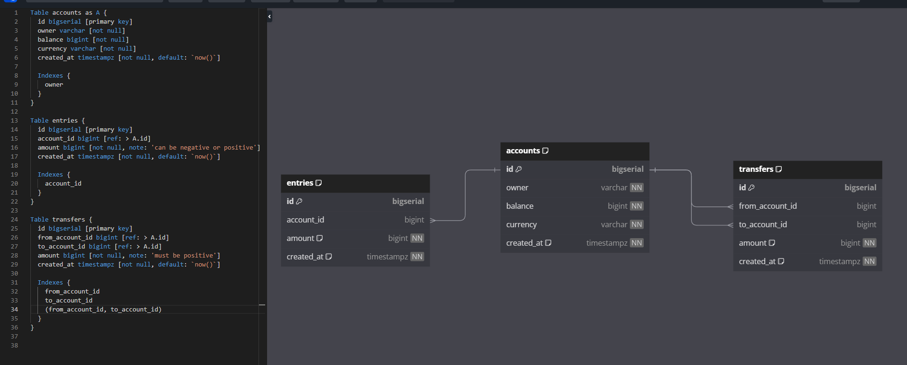

# Simple Bank Project

This is a simple banking system written in Go, designed as a practice project to demonstrate fundamental Go concepts such as struct definitions, concurrency, and basic CRUD operations.

Database schema 

Tools used:
  1. https://dbdiagram.io/ (generating image and postgres sql file)
  2. docker 
  3. postgres
  4. tablePlus (visual helper for DB)
  5. MIGRATE https://github.com/golang-migrate/migrate
  6. SQLC https://sqlc.dev/
  7. 